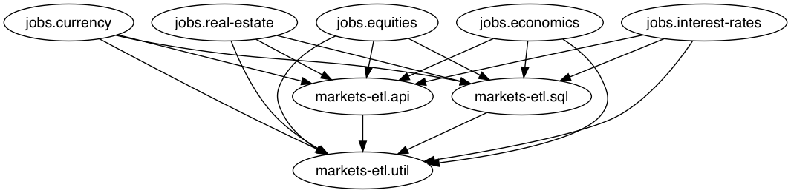

## m a r k e t s - e t l
: (etl '(all the financial data))

[CircleCI Builds](https://circleci.com/gh/skilbjo/markets-etl)


[](https://quay.io/repository/skilbjo/markets-etl)
[](https://codecov.io/gh/skilbjo/markets-etl)

[](https://healthchecks.io/badge/80da65e9-ff8f-45f1-b75e-109790/ZBYwWgw3/markets-etl_sfo.svg)
[](https://healthchecks.io/badge/80da65e9-ff8f-45f1-b75e-109790/yfJXsnyi/markets-etl_aws.svg)

### What

ETL project of financial data: equity prices, bond yields, risk free rate of return,
GDP data, currency prices, and real estate indecies by zip code.

[Quandl](https://www.quandl.com/) has this data available in an API, so this
project wraps for insertion to a target postgresql database.

See my talk from the February 2017 Clojure PDX meetup for more about the project
<https://github.com/skilbjo/articles/blob/master/talks/bare_metal_to_aws_lambda.md>


### TODOs

- [X] Generic key mapper (xform into postgres column names)
- [X] Generic value mapper (xform into postgres dates)
- [X] Upsert-multi function <<-- this was a hard one
- [X] Come up with a time/now - subtract 5 days
- [X] Look at JVM settings in profile.clj (does jar need profile?) & deploy/bin/run-job
- [X] Model economics / interest_rates appropriately
- [X] For currency, parse out usd currency and put in column (ie, EUR)
- [ ] Better naming, any ideas for refactoring



### environment variables
```bash
export quandl_api_key=''
export jdbc_db_uri=''
export test_jdbc_db_uri=$jdbc_db_uri
```

### Run manually

```bash
lein trampoline run -m jobs.equities
LEIN_FAST_TRAMPOLINE=true lein trampoline run -m jobs.equities
llein run -m jobs.equities
```

#### Run backfill
```bash
lein run -m backfill.equities -d 2018-06-30
```

### lein

#### Dependencies
```bash
lein deps :tree 2>deps 1>/dev/null && vim deps
```

#### cljfmt
```bash
lein cljfmt check ; lein cljfmt fix
```

#### kibits
```bash
lein kibit >tmp ; vim tmp && rm tmp
```

#### testing in the repl
```clojure
(refresh)
(use '[clojure.tools.namespace.repl :only (refresh)])
(require '[markets-etl.api :as api])

(def ticker "FB")
(def query-params
  {:limit      500
   :start_date "2018-07-25"
   :end_date   "2018-07-28"})

(api/query-tiingo! ticker query-params)
```

### Git

#### Git remotes
```bash
git remote add pi-vpn ssh://skilbjo@router.:43/~/deploy/git/markets-etl.git
git remote add pi-home ssh://skilbjo@pi1/~/deploy/git/markets-etl.git
```

#### Pre-commit hook to update pom.xml
```bash
vim .git/hooks/pre-commit

#!/usr/bin/env bash

lein pom 2>&1 dev-resources/pom.xml
```

#### Quirks with Alpine + Vim + Jars
In order to edit a jar with vim in alpine linux, install a non-busybox unzip
binary. The busybox binary:

```
BusyBox v1.25.1 (2017-11-23 08:48:46 GMT) multi-call binary.

Usage: unzip [-lnopq] FILE[.zip] [FILE]... [-x FILE...] [-d DIR]
```

is not the fully featured version. This is:

```
UnZip 6.00 of 20 April 2009, by Info-ZIP.  Maintained by C. Spieler.  Send
bug reports using http://www.info-zip.org/zip-bug.html; see README for details.

Usage: unzip [-Z] [-opts[modifiers]] file[.zip] [list] [-x xlist] [-d exdir]
```

install with:

```
apk add --no-cache unzip
```

#### Benchmarks
Clojure core functions (map, reduce) vs reducers (r/map, r/reduce):

```clojure
(defn execute! [cxn data]
  (jdbc/with-db-transaction [txn cxn]
    (->> data
         (map prepare-row)
         flatten
         (map #(update-or-insert! txn %))
         doall)))
```

```clojure
(defn execute!' [cxn data]
  (jdbc/with-db-transaction [txn cxn]
    (->> data
         (r/map prepare-row)
         (into '())
         flatten
         (map #(update-or-insert! txn %))
         doall)))
```

```bash
@mbp:markets-etl $ lein run -m benchmark.equities

### Traditional Clojure core functions
Evaluation count : 540 in 60 samples of 9 calls.
             Execution time mean : 131.794661 ms
    Execution time std-deviation : 20.667398 ms
   Execution time lower quantile : 108.522897 ms ( 2.5%)
   Execution time upper quantile : 190.814936 ms (97.5%)
                   Overhead used : 2.252589 ns

Found 5 outliers in 60 samples (8.3333 %)
        low-severe       3 (5.0000 %)
        low-mild         2 (3.3333 %)
 Variance from outliers : 85.8712 % Variance is severely inflated by outliers

### Clojure reducer functions
Evaluation count : 360 in 60 samples of 6 calls.
             Execution time mean : 172.229434 ms
    Execution time std-deviation : 24.243476 ms
   Execution time lower quantile : 146.725239 ms ( 2.5%)
   Execution time upper quantile : 235.378479 ms (97.5%)
                   Overhead used : 2.252589 ns

Found 3 outliers in 60 samples (5.0000 %)
        low-severe       3 (5.0000 %)
 Variance from outliers : 82.4206 % Variance is severely inflated by outliers
```
